# E-Commerce Design Patterns (TypeScript)

A production-grade e-commerce system demonstrating **23 Gang of Four (GoF) design patterns** in TypeScript. Built with SOLID principles, clean architecture, and full testability.

## Architecture Overview


```mermaid
graph TD
    subgraph "Presentation / Entry"
        CI[Client] --> CF[CheckoutFacade]
        CI --> OF[OrderFacade]
    end

    subgraph "Auth"
        AS[AuthService] --> AT[AuthenticationTemplate]
        AT --> AS1[JwtStrategy]
        AT --> AS2[OAuthStrategy]
        AT --> AS3[SessionStrategy]
    end

    subgraph "Payment"
        PF[PaymentFactory] --> PP1[CreditCardProcessor]
        PF --> PP2[PayPalProcessor]
        PF --> PP3[CryptoProcessor]
        AD1[StripeAdapter] -.-> PP1
        AD2[PayPalApiAdapter] -.-> PP2
        CP[CheckoutPaymentContext] --> PS1[CreditCardStrategy]
        CP --> PS2[PayPalStrategy]
    end

    subgraph "Order"
        OF --> OC[OrderContext]
        OF --> OI[OrderCommandInvoker]
        OC --> OS[OrderState]
        OI --> C1[PlaceOrderCommand]
        OI --> C2[CancelOrderCommand]
        OI --> C3[RefundOrderCommand]
    end

    subgraph "Catalog"
        CT[CategoryComposite] --> PL[ProductLeaf]
        IT[DepthFirstIterator]
        IT2[BreadthFirstIterator]
    end

    subgraph "Notification"
        NP[NotificationPublisher] --> EO[EmailObserver]
        NP --> SO[SmsObserver]
        NP --> PO[PushObserver]
        NB[NotificationBridge] --> ES[EmailSender]
        NB --> SS[SmsSender]
        NB --> PS[PushSender]
    end

    subgraph "Middleware"
        CH[LoggingMiddleware] --> AH[AuthMiddleware]
        AH --> VM[ValidationMiddleware]
        LH[LoggingDecorator] --> BH[BaseHttpHandler]
        RL[RateLimitDecorator] --> LH
    end

    subgraph "Infrastructure"
        LG[Logger - Singleton]
        CM[ConfigManager - Singleton]
        CPX[CachingProxy] --> DS[RealDataService]
        AP[AccessControlProxy] --> DS
    end

    subgraph "Storage"
        PGF[PostgresFactory] --> PR[ProductRepo]
        PGF --> OR[OrderRepo]
        PGF --> UR[UserRepo]
        MGF[MongoFactory] --> PR
        MGF --> OR
        MGF --> UR
    end

    subgraph "Common"
        PB[ProductBuilder]
        PPR[ProductPrototype]
        PFF[FlyweightFactory]
        OMT[OrderMemento]
        MD[CartMediator]
        RV[ReportVisitor]
        DV[DiscountVisitor]
    end

    CF --> NP
    CF --> OF
    OF --> PF
    OF --> CP
    CH --> RL
    CPX --> PGF
```

---

## Creational Patterns

### 1. Builder — `src/common/builder/product.builder.ts`

Constructs complex `Product` objects step-by-step, allowing optional fields and fluent configuration.

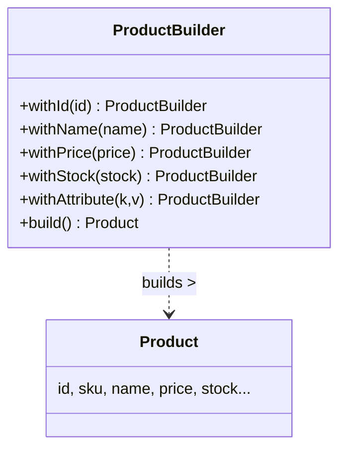
```mermaid
classDiagram
    class ProductBuilder {
        +withId(id) ProductBuilder
        +withName(name) ProductBuilder
        +withPrice(price) ProductBuilder
        +withStock(stock) ProductBuilder
        +withAttribute(k,v) ProductBuilder
        +build() Product
    }
    class Product {
        id, sku, name, price, stock...
    }
    ProductBuilder ..> Product : builds >
```

```typescript
const product = new ProductBuilder()
  .withId('prod_1')
  .withSku('SKU-001')
  .withName('Widget')
  .withPrice(49.99)
  .withStock(250)
  .build();
```

---

### 2. Factory Method — `src/payment/payment-factory.ts` + `src/report/factory-method/`

Defines an interface for creating objects but lets subclasses decide which class to instantiate. Used in both **Payment** (processor creation) and **Report** (report generation).

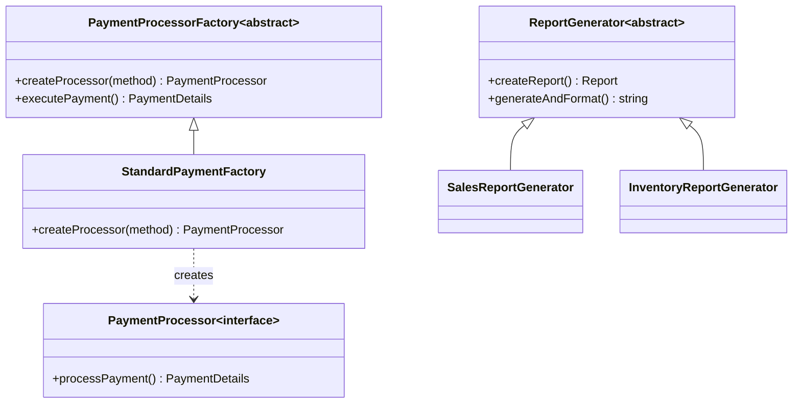
```mermaid
classDiagram
    class PaymentProcessorFactory~abstract~ {
        +createProcessor(method) PaymentProcessor
        +executePayment() PaymentDetails
    }
    class StandardPaymentFactory {
        +createProcessor(method) PaymentProcessor
    }
    class PaymentProcessor~interface~ {
        +processPayment() PaymentDetails
    }
    PaymentProcessorFactory <|-- StandardPaymentFactory
    StandardPaymentFactory ..> PaymentProcessor : creates

    class ReportGenerator~abstract~ {
        +createReport() Report
        +generateAndFormat() string
    }
    class SalesReportGenerator
    class InventoryReportGenerator
    ReportGenerator <|-- SalesReportGenerator
    ReportGenerator <|-- InventoryReportGenerator
```

---

### 3. Abstract Factory — `src/storage/abstract-factory/`

Provides an interface for creating *families* of related objects (repositories) without specifying concrete classes.

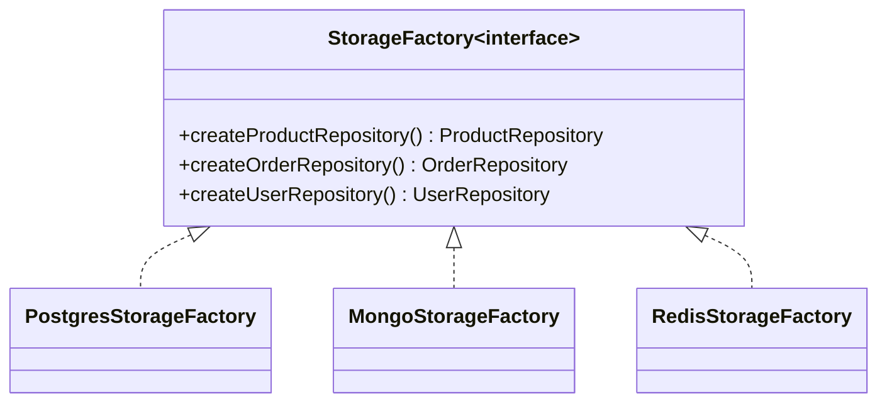
```mermaid
classDiagram
    class StorageFactory~interface~ {
        +createProductRepository() ProductRepository
        +createOrderRepository() OrderRepository
        +createUserRepository() UserRepository
    }
    class PostgresStorageFactory
    class MongoStorageFactory
    class RedisStorageFactory
    StorageFactory <|.. PostgresStorageFactory
    StorageFactory <|.. MongoStorageFactory
    StorageFactory <|.. RedisStorageFactory
```

```typescript
const factory: StorageFactory = new PostgresStorageFactory();
const productRepo = factory.createProductRepository();
const orderRepo = factory.createOrderRepository();
```

---

### 4. Prototype — `src/common/prototype/product.prototype.ts`

Creates new objects by cloning an existing instance, avoiding costly construction.

```typescript
const prototype = new ProductPrototype(original);
const clone = prototype.clone();
const customClone = prototype.cloneWithOverrides({ price: 39.99 });
```

---

### 5. Singleton — `src/infrastructure/singleton/`

Ensures a class has only one instance and provides a global access point. Used for **Logger** and **ConfigManager**.

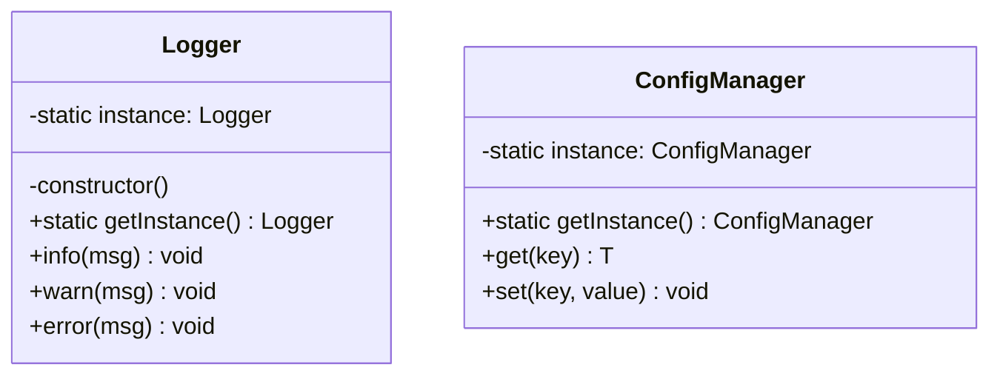
```mermaid
classDiagram
    class Logger {
        -static instance: Logger
        -constructor()
        +static getInstance() Logger
        +info(msg) void
        +warn(msg) void
        +error(msg) void
    }
    class ConfigManager {
        -static instance: ConfigManager
        +static getInstance() ConfigManager
        +get(key) T
        +set(key, value) void
    }
```

```typescript
const logger = Logger.getInstance();
const config = ConfigManager.getInstance();
```

---

## Structural Patterns

### 6. Adapter — `src/payment/adapters/`

Converts the interface of a class into another interface clients expect. Wraps **Stripe SDK** and **PayPal API** into a common `PaymentProcessor` interface.

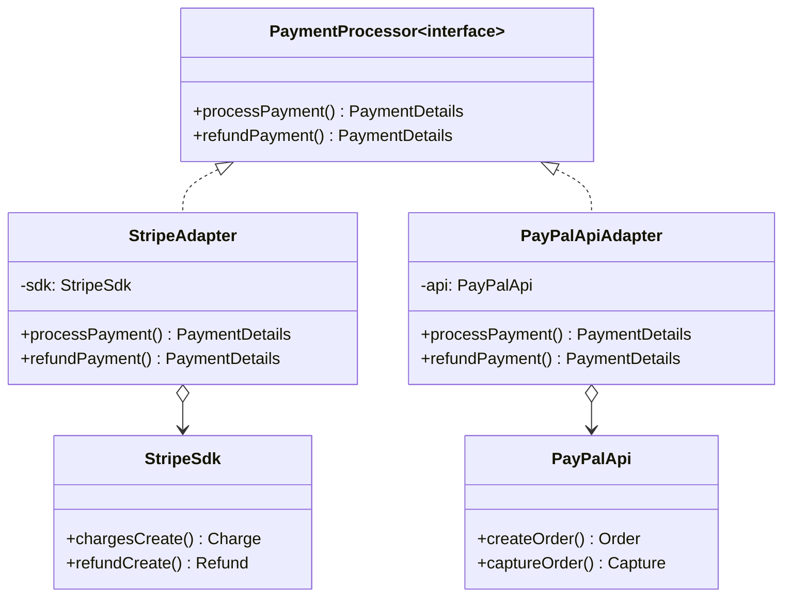
```mermaid
classDiagram
    class PaymentProcessor~interface~ {
        +processPayment() PaymentDetails
        +refundPayment() PaymentDetails
    }
    class StripeSdk {
        +chargesCreate() Charge
        +refundCreate() Refund
    }
    class StripeAdapter {
        -sdk: StripeSdk
        +processPayment() PaymentDetails
        +refundPayment() PaymentDetails
    }
    class PayPalApi {
        +createOrder() Order
        +captureOrder() Capture
    }
    class PayPalApiAdapter {
        -api: PayPalApi
        +processPayment() PaymentDetails
        +refundPayment() PaymentDetails
    }
    PaymentProcessor <|.. StripeAdapter
    PaymentProcessor <|.. PayPalApiAdapter
    StripeAdapter o--> StripeSdk
    PayPalApiAdapter o--> PayPalApi
```

---

### 7. Bridge — `src/notification/bridge/`

Decouples an abstraction from its implementation so both can vary independently. **Notification type** (order, promo) is separate from **delivery channel** (email, SMS, push).

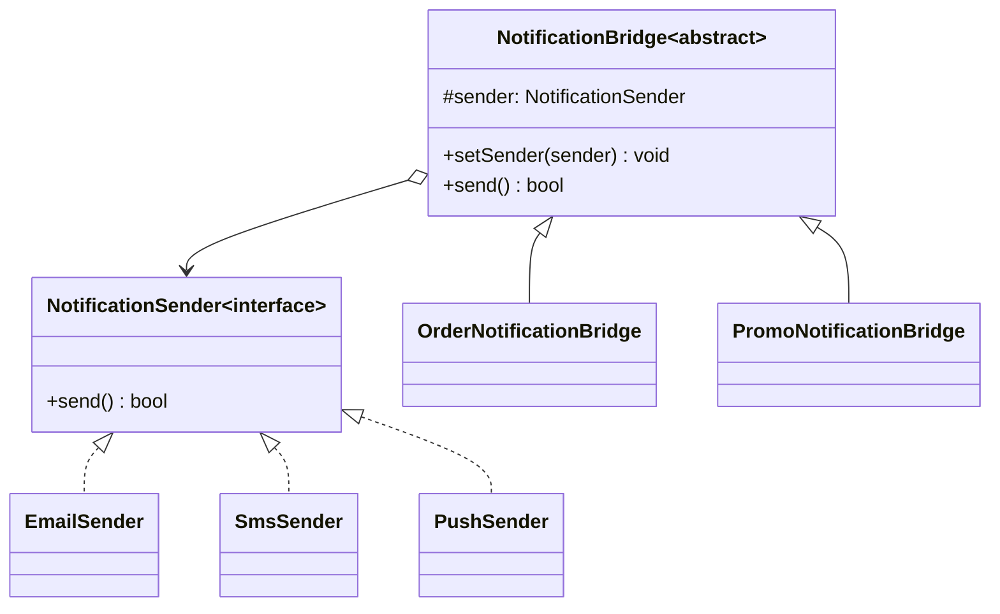
```mermaid
classDiagram
    class NotificationBridge~abstract~ {
        #sender: NotificationSender
        +setSender(sender) void
        +send() bool
    }
    class NotificationSender~interface~ {
        +send() bool
    }
    class OrderNotificationBridge
    class PromoNotificationBridge
    class EmailSender
    class SmsSender
    class PushSender
    NotificationBridge <|-- OrderNotificationBridge
    NotificationBridge <|-- PromoNotificationBridge
    NotificationSender <|.. EmailSender
    NotificationSender <|.. SmsSender
    NotificationSender <|.. PushSender
    NotificationBridge o--> NotificationSender
```

```typescript
const notifier = new OrderNotificationBridge(new EmailSender());
await notifier.send(orderConfirmation);

notifier.setSender(new SmsSender());
await notifier.send(shippingAlert);
```

---

### 8. Composite — `src/catalog/composite/`

Composes objects into tree structures to represent part-whole hierarchies. **Categories** contain subcategories or **Product** leaves.

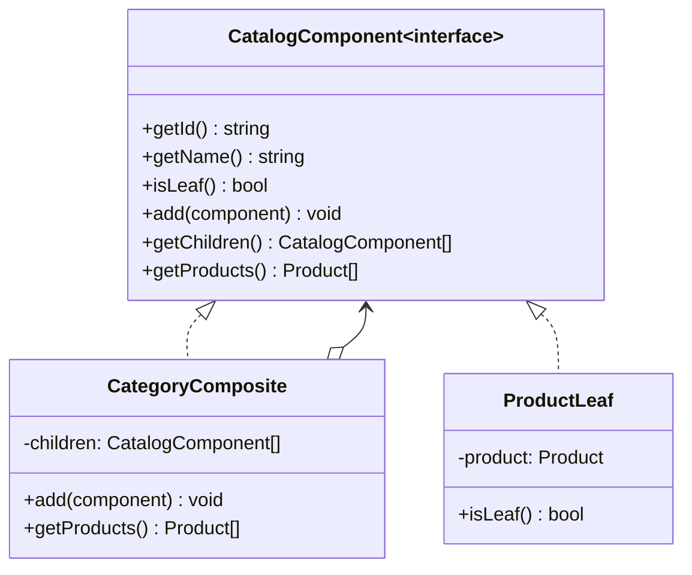
```mermaid
classDiagram
    class CatalogComponent~interface~ {
        +getId() string
        +getName() string
        +isLeaf() bool
        +add(component) void
        +getChildren() CatalogComponent[]
        +getProducts() Product[]
    }
    class CategoryComposite {
        -children: CatalogComponent[]
        +add(component) void
        +getProducts() Product[]
    }
    class ProductLeaf {
        -product: Product
        +isLeaf() bool
    }
    CatalogComponent <|.. CategoryComposite
    CatalogComponent <|.. ProductLeaf
    CategoryComposite o--> CatalogComponent
```

```typescript
const electronics = new CategoryComposite('cat_1', 'Electronics');
electronics.add(new ProductLeaf(laptop));
electronics.add(new ProductLeaf(phone));

const root = new CategoryComposite('cat_0', 'Root');
root.add(electronics);
root.getTotalProducts(); // 2
```

---

### 9. Decorator — `src/middleware/decorator/`

Attaches additional responsibilities to an object dynamically. Wraps `HttpHandler` with logging and rate-limiting.

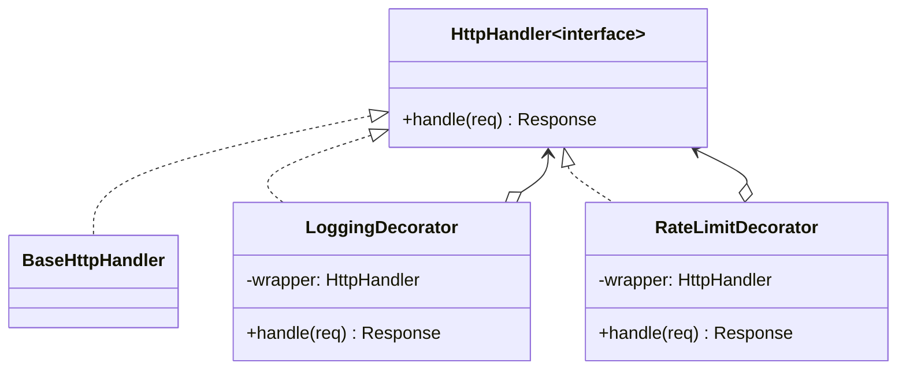
```mermaid
classDiagram
    class HttpHandler~interface~ {
        +handle(req) Response
    }
    class BaseHttpHandler
    class LoggingDecorator {
        -wrapper: HttpHandler
        +handle(req) Response
    }
    class RateLimitDecorator {
        -wrapper: HttpHandler
        +handle(req) Response
    }
    HttpHandler <|.. BaseHttpHandler
    HttpHandler <|.. LoggingDecorator
    HttpHandler <|.. RateLimitDecorator
    LoggingDecorator o--> HttpHandler
    RateLimitDecorator o--> HttpHandler
```

```typescript
const handler = new RateLimitDecorator(
  new LoggingDecorator(new BaseHttpHandler())
);
await handler.handle(request);
```

---

### 10. Facade — `src/order/facade/` + `src/checkout/facade/`

Provides a unified interface to a set of interfaces in a subsystem. Makes complex subsystems (order + payment + state + commands) easier to use.

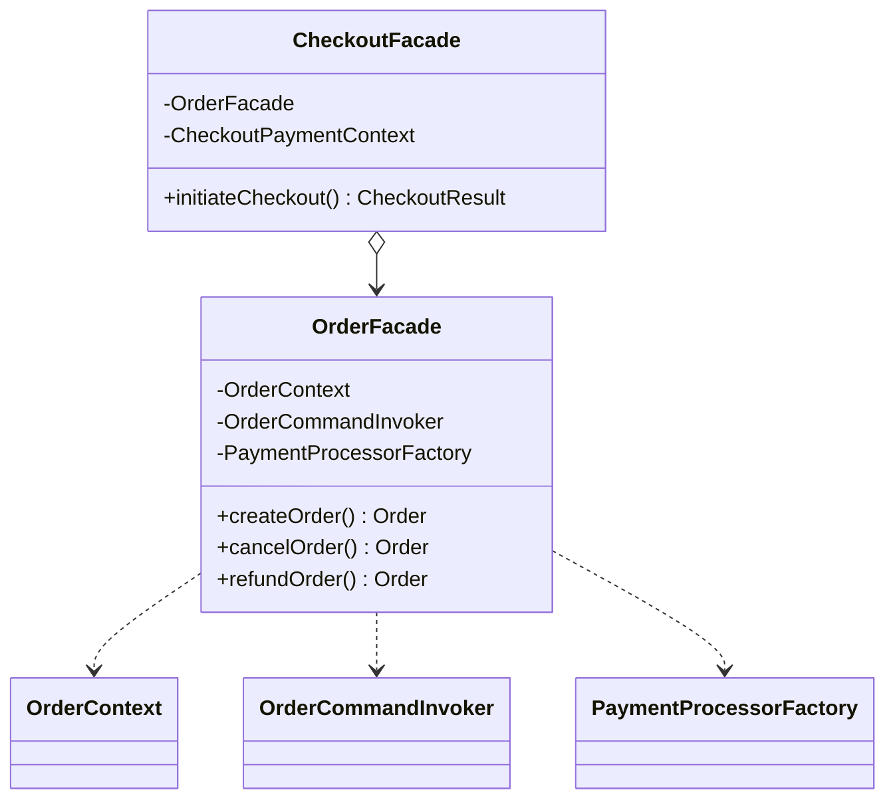
```mermaid
classDiagram
    class OrderFacade {
        -OrderContext
        -OrderCommandInvoker
        -PaymentProcessorFactory
        +createOrder() Order
        +cancelOrder() Order
        +refundOrder() Order
    }
    class CheckoutFacade {
        -OrderFacade
        -CheckoutPaymentContext
        +initiateCheckout() CheckoutResult
    }
    OrderFacade ..> OrderContext
    OrderFacade ..> OrderCommandInvoker
    OrderFacade ..> PaymentProcessorFactory
    CheckoutFacade o--> OrderFacade
```

---

### 11. Flyweight — `src/common/flyweight/`

Shares common (intrinsic) state across many objects to minimize memory usage. Product categories, brands, and policies are shared; serial numbers and colors are extrinsic.

```typescript
const factory = new ProductFlyweightFactory();
const shared = factory.getFlyweight({
  category: 'Electronics', brand: 'Generic',
  supplier: 'SupplierA', warrantyMonths: 12, returnPolicy: '30 days',
});
// Thousands of products reuse the same flyweight
shared.display({ serial: 'SN001', color: 'black' });
```

---

### 12. Proxy — `src/infrastructure/proxy/`

Provides a surrogate or placeholder for another object to control access. **CachingProxy** caches DB results; **AccessControlProxy** enforces permissions.

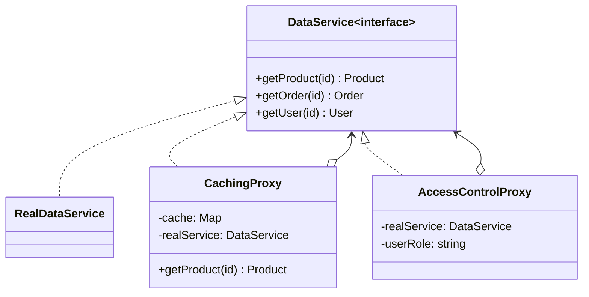
```mermaid
classDiagram
    class DataService~interface~ {
        +getProduct(id) Product
        +getOrder(id) Order
        +getUser(id) User
    }
    class RealDataService
    class CachingProxy {
        -cache: Map
        -realService: DataService
        +getProduct(id) Product
    }
    class AccessControlProxy {
        -realService: DataService
        -userRole: string
    }
    DataService <|.. RealDataService
    DataService <|.. CachingProxy
    DataService <|.. AccessControlProxy
    CachingProxy o--> DataService
    AccessControlProxy o--> DataService
```

---

## Behavioral Patterns

### 13. Template Method — `src/auth/auth-template.ts`

Defines the skeleton of an algorithm in a method, deferring some steps to subclasses. The auth flow skeleton (`login → verify → logout`) is fixed; hooks allow customization.

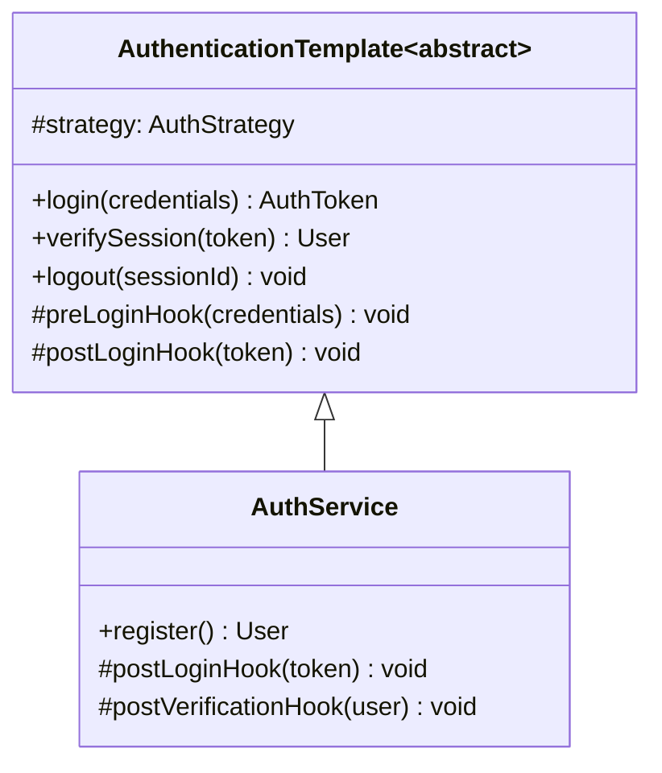
```mermaid
classDiagram
    class AuthenticationTemplate~abstract~ {
        #strategy: AuthStrategy
        +login(credentials) AuthToken
        +verifySession(token) User
        +logout(sessionId) void
        #preLoginHook(credentials) void
        #postLoginHook(token) void
    }
    class AuthService {
        +register() User
        #postLoginHook(token) void
        #postVerificationHook(user) void
    }
    AuthenticationTemplate <|-- AuthService
```

```typescript
const auth = new AuthService(new JwtStrategy());
const token = await auth.login({ email, password });
// Template calls: preLoginHook → authenticate → postLoginHook
```

---

### 14. Strategy — `src/auth/strategy` + `src/payment/strategy`

Encapsulates an algorithm inside a class, making them interchangeable. Used in **Auth** (JWT/OAuth/Session) and **Payment** (CreditCard/PayPal).

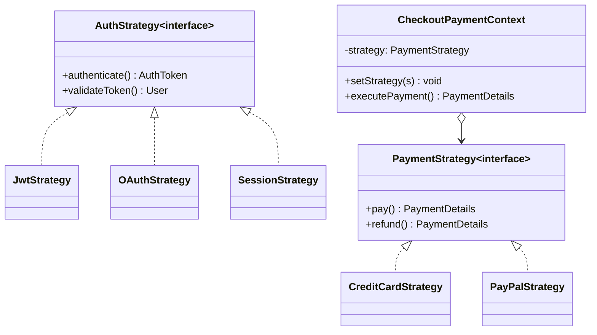
```mermaid
classDiagram
    class AuthStrategy~interface~ {
        +authenticate() AuthToken
        +validateToken() User
    }
    class JwtStrategy
    class OAuthStrategy
    class SessionStrategy
    AuthStrategy <|.. JwtStrategy
    AuthStrategy <|.. OAuthStrategy
    AuthStrategy <|.. SessionStrategy

    class PaymentStrategy~interface~ {
        +pay() PaymentDetails
        +refund() PaymentDetails
    }
    class CreditCardStrategy
    class PayPalStrategy
    class CheckoutPaymentContext {
        -strategy: PaymentStrategy
        +setStrategy(s) void
        +executePayment() PaymentDetails
    }
    PaymentStrategy <|.. CreditCardStrategy
    PaymentStrategy <|.. PayPalStrategy
    CheckoutPaymentContext o--> PaymentStrategy
```

---

### 15. State — `src/order/state/`

Allows an object to alter its behavior when its internal state changes. Order lifecycle is modeled across 7 states with a registry of valid transitions.

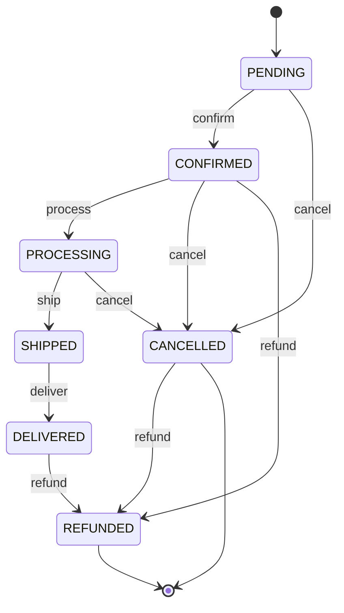
```mermaid
stateDiagram-v2
    [*] --> PENDING
    PENDING --> CONFIRMED : confirm
    PENDING --> CANCELLED : cancel
    CONFIRMED --> PROCESSING : process
    CONFIRMED --> CANCELLED : cancel
    CONFIRMED --> REFUNDED : refund
    PROCESSING --> SHIPPED : ship
    PROCESSING --> CANCELLED : cancel
    SHIPPED --> DELIVERED : deliver
    DELIVERED --> REFUNDED : refund
    CANCELLED --> REFUNDED : refund
    CANCELLED --> [*]
    REFUNDED --> [*]
```

```typescript
const context = new OrderContext();
context.advance('confirm'); // PENDING → CONFIRMED
context.advance('ship');    // CONFIRMED → SHIPPED
context.getAvailableActions(); // ['deliver']
```

---

### 16. Command — `src/order/commands/`

Encapsulates a request as an object, allowing parameterization, queuing, and undo. **PlaceOrder**, **CancelOrder**, and **RefundOrder** commands are executed by an invoker with history.

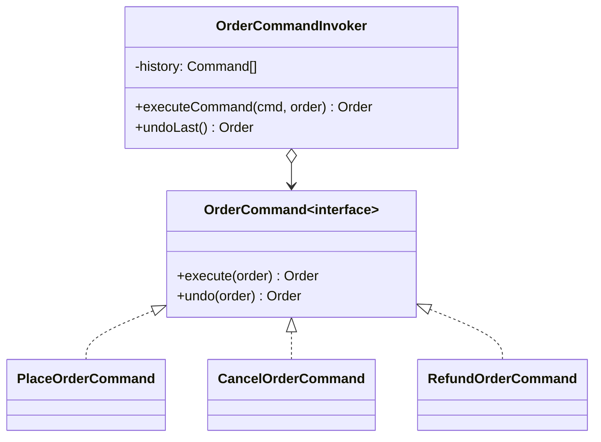
```mermaid
classDiagram
    class OrderCommand~interface~ {
        +execute(order) Order
        +undo(order) Order
    }
    class PlaceOrderCommand
    class CancelOrderCommand
    class RefundOrderCommand
    class OrderCommandInvoker {
        -history: Command[]
        +executeCommand(cmd, order) Order
        +undoLast() Order
    }
    OrderCommand <|.. PlaceOrderCommand
    OrderCommand <|.. CancelOrderCommand
    OrderCommand <|.. RefundOrderCommand
    OrderCommandInvoker o--> OrderCommand
```

```typescript
const invoker = new OrderCommandInvoker();
await invoker.executeCommand(new PlaceOrderCommand(), order);
await invoker.undoLast(); // reverts to previous state
```

---

### 17. Observer — `src/notification/observer/`

Defines a one-to-many dependency between objects so that when one changes state, all dependents are notified. Notifications published on channels (order.confirmed, shipping.update) reach all subscribers.

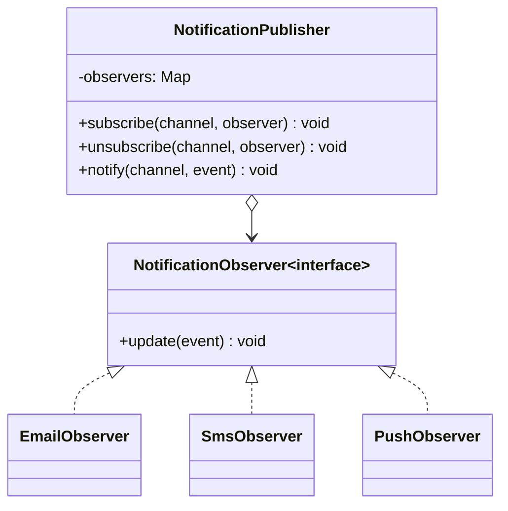
```mermaid
classDiagram
    class NotificationObserver~interface~ {
        +update(event) void
    }
    class EmailObserver
    class SmsObserver
    class PushObserver
    class NotificationPublisher {
        -observers: Map
        +subscribe(channel, observer) void
        +unsubscribe(channel, observer) void
        +notify(channel, event) void
    }
    NotificationObserver <|.. EmailObserver
    NotificationObserver <|.. SmsObserver
    NotificationObserver <|.. PushObserver
    NotificationPublisher o--> NotificationObserver
```

```typescript
publisher.subscribe('order.confirmed', new EmailObserver());
await publisher.notify('order.confirmed', {
  recipient: 'user@example.com',
  subject: 'Order Confirmed',
  body: 'Your order #1234 is confirmed.',
});
```

---

### 18. Chain of Responsibility — `src/middleware/chain/`

Passes a request along a chain of handlers. Each handler decides to process or forward to the next. Request flows through **Logging → Auth → Validation**.

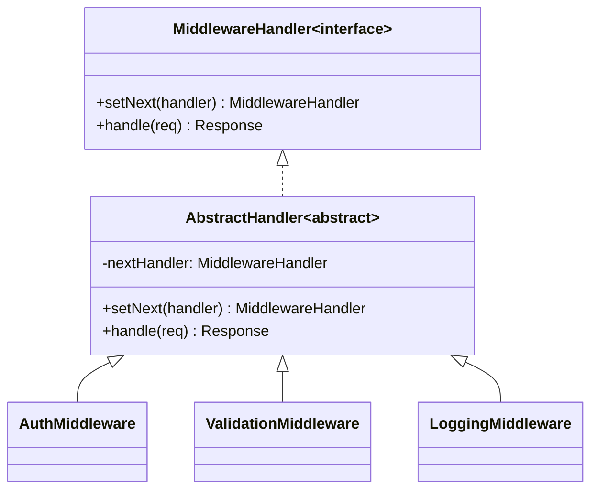
```mermaid
classDiagram
    class MiddlewareHandler~interface~ {
        +setNext(handler) MiddlewareHandler
        +handle(req) Response
    }
    class AbstractHandler~abstract~ {
        -nextHandler: MiddlewareHandler
        +setNext(handler) MiddlewareHandler
        +handle(req) Response
    }
    class AuthMiddleware
    class ValidationMiddleware
    class LoggingMiddleware
    MiddlewareHandler <|.. AbstractHandler
    AbstractHandler <|-- AuthMiddleware
    AbstractHandler <|-- ValidationMiddleware
    AbstractHandler <|-- LoggingMiddleware
```

```typescript
const chain = new LoggingMiddleware();
chain
  .setNext(new AuthMiddleware())
  .setNext(new ValidationMiddleware());

await chain.handle(request); // Logging → Auth → Validation
```

---

### 19. Mediator — `src/common/mediator/cart-mediator.ts`

Defines an object that encapsulates how a set of objects interact. The **CartMediator** coordinates inventory, shipping, and billing components when checkout completes.

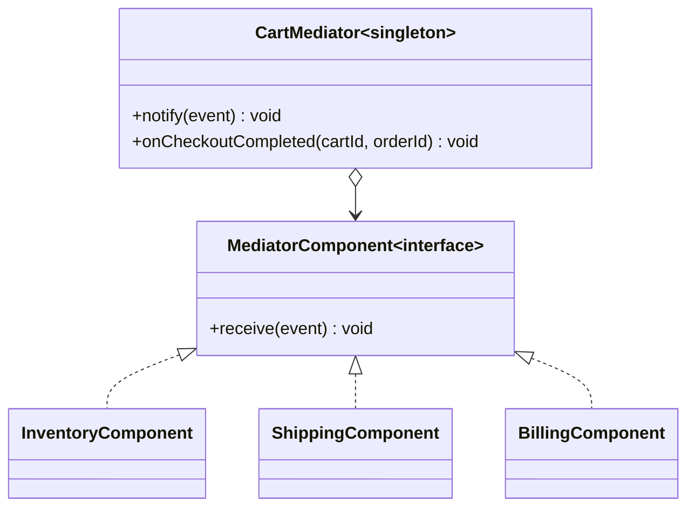
```mermaid
classDiagram
    class CartMediator~singleton~ {
        +notify(event) void
        +onCheckoutCompleted(cartId, orderId) void
    }
    class MediatorComponent~interface~ {
        +receive(event) void
    }
    class InventoryComponent
    class ShippingComponent
    class BillingComponent
    CartMediator o--> MediatorComponent
    MediatorComponent <|.. InventoryComponent
    MediatorComponent <|.. ShippingComponent
    MediatorComponent <|.. BillingComponent
```

```typescript
registerCheckoutComponents();
const mediator = CartMediator.getInstance();
await mediator.onCheckoutCompleted('cart_1', 'order_1');
// InventoryComponent: Reserving stock...
// ShippingComponent: Creating shipment...
```

---

### 20. Memento — `src/common/memento/`

Captures and externalizes an object's internal state so it can be restored later. **OrderMemento** stores a snapshot of the entire order.

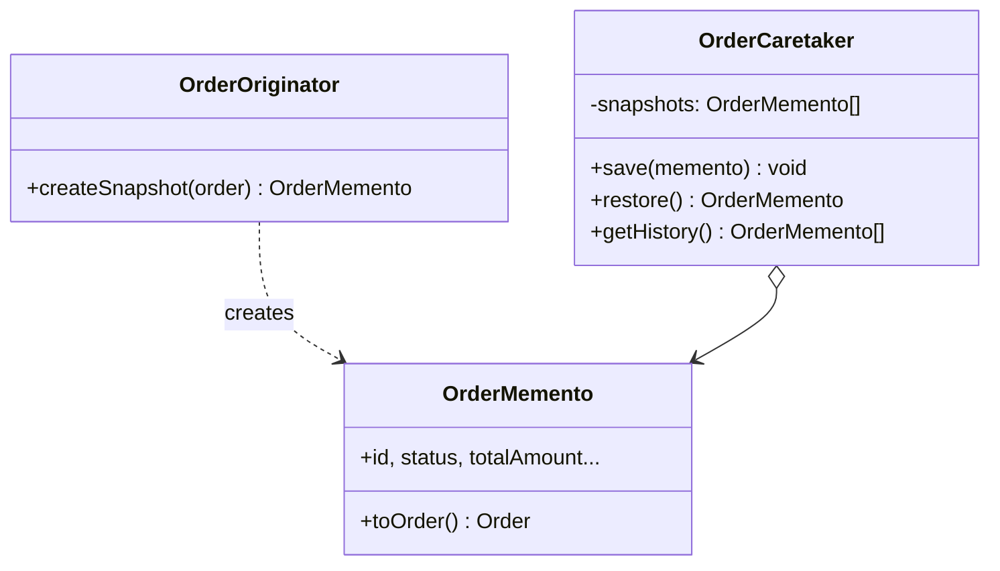
```mermaid
classDiagram
    class OrderMemento {
        +id, status, totalAmount...
        +toOrder() Order
    }
    class OrderOriginator {
        +createSnapshot(order) OrderMemento
    }
    class OrderCaretaker {
        -snapshots: OrderMemento[]
        +save(memento) void
        +restore() OrderMemento
        +getHistory() OrderMemento[]
    }
    OrderOriginator ..> OrderMemento : creates
    OrderCaretaker o--> OrderMemento
```

```typescript
const snapshot = originator.createSnapshot(order);
caretaker.save(snapshot);
// ... later ...
const restored = caretaker.restore()!.toOrder();
```

---

### 21. Visitor — `src/common/visitor/`

Represents an operation to be performed on elements of an object structure. **ReportVisitor** generates reports for Products, Orders, and Users; **DiscountVisitor** calculates applicable discounts.

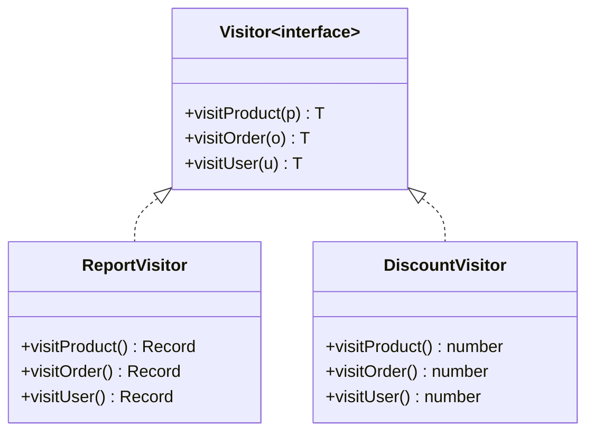
```mermaid
classDiagram
    class Visitor~interface~ {
        +visitProduct(p) T
        +visitOrder(o) T
        +visitUser(u) T
    }
    class ReportVisitor {
        +visitProduct() Record
        +visitOrder() Record
        +visitUser() Record
    }
    class DiscountVisitor {
        +visitProduct() number
        +visitOrder() number
        +visitUser() number
    }
    Visitor <|.. ReportVisitor
    Visitor <|.. DiscountVisitor
```

```typescript
const discount = new DiscountVisitor();
const productDiscount = discountVisitor.visitProduct(product); // $15
const orderDiscount  = discountVisitor.visitOrder(order);      // $112.50 (15%)
```

---

### 22. Iterator — `src/catalog/iterator/`

Provides a way to access elements of an aggregate object sequentially without exposing its underlying representation. **DepthFirstIterator** and **BreadthFirstIterator** traverse the catalog tree.

```mermaid
classDiagram
    class CatalogIterator~interface~ {
        +current() T
        +next() T
        +hasNext() bool
        +reset() void
    }
    class DepthFirstIterator {
        -stack: CatalogComponent[]
        -currentIndex: number
    }
    class BreadthFirstIterator {
        -queue: CatalogComponent[]
        -currentIndex: number
    }
    CatalogIterator <|.. DepthFirstIterator
    CatalogIterator <|.. BreadthFirstIterator
```

```typescript
const dfs = new DepthFirstIterator(root);
while (dfs.hasNext()) {
  const component = dfs.next();
  // Traverses tree depth-first
}

const bfs = new BreadthFirstIterator(root);
// Traverses tree level-by-level
```

---

## Running the Project

```bash
# Install dependencies
npm install

# Build TypeScript
npm run build

# Run the demo (demonstrates all 23 patterns)
node dist/index.js

# Or run directly with ts-node
npm run dev
```

## Design Principles Applied

| Principle | Implementation |
|-----------|---------------|
| **Single Responsibility** | Each class has one reason to change — `NotificationPublisher` only publishes, `EmailSender` only sends emails |
| **Open/Closed** | Add new payment processors via `PaymentProcessor` interface without modifying existing code |
| **Liskov Substitution** | All `OrderState` implementations are interchangeable through `OrderContext` |
| **Interface Segregation** | Separate `AuthStrategy`, `PaymentStrategy`, `OrderCommand` interfaces — no fat interfaces |
| **Dependency Inversion** | High-level `OrderFacade` depends on `PaymentProcessorFactory` (abstraction), not `StandardPaymentFactory` (concrete) |
| **DRY** | Shared flyweight states reused across products; common interfaces prevent duplication |
| **Concurrency Safety** | All async operations use `await`; state machines guard transitions; singletons are thread-safe |
